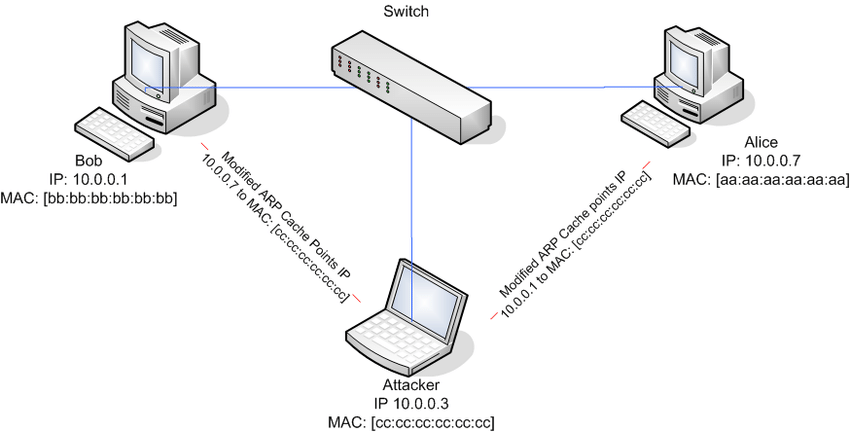
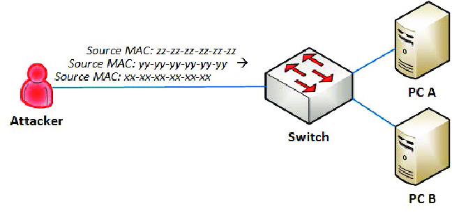
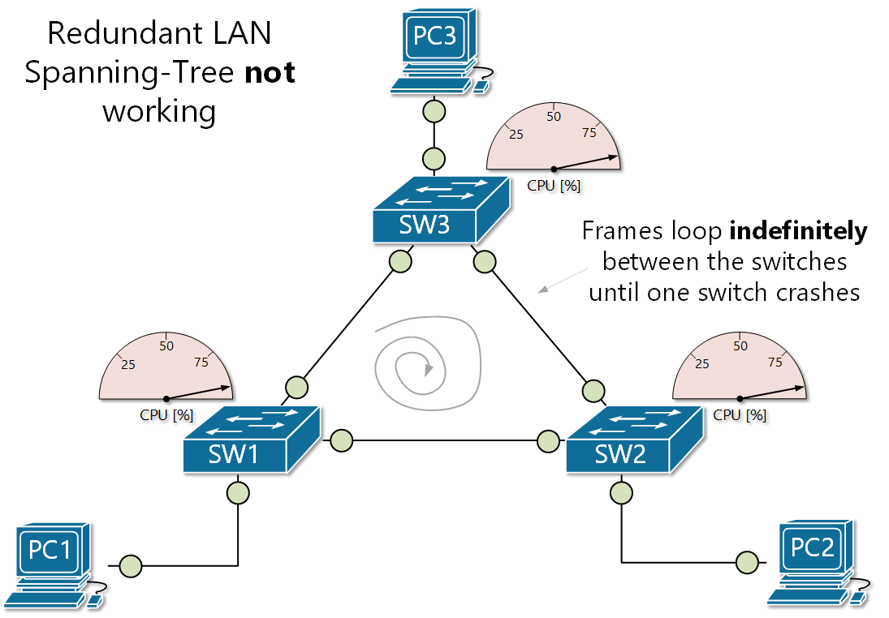

# Chapter 7 Securing the Basic LAN

## Data Protection

### Data resides in

- Data at rest
  - Data sitting on a hard drive, ssd, cd, etc.
  - Data sitting doing nothing
  - Bruteforcing is common with this data
- Data in use/computation
  - Something actively using data
  - Software, RAM, CPU using data actively
  - Often unencrypted
  - Shoulder surfing or viewing programs in ram easy attack vector
- Data in Transit
  - Data going to one system to another
  - Sniffing attacks are common
    - MITM
  - Wired connections are harder to sniff
  - Wireless connections are very easy to sniff and attack via MITM

## Cryptographic Methods

### Symmetric Encryption

- encrypt message with a key
- Only person to decrypt the message they need the same key
- In-band
  - Sending key with the encrypted data
- Out-of-band
  - Physically showing someone the key in person
- **Primary way we encrypt data**

### Ephemeral Key

- Temporary
- Provides perfect forward secrecy

### Asymmetric Encryption

- Uses a key pair
  - Public key
  - Private key
- Public key is only used to encrypt
- Private key is only used to decrypt
- Send public key then encrypt text then send it over and the holder of the private key can decrypt the message
- Asymmetric encryption is used to send a secure session key

### Cryptosystem

- Highly defined process that is easier to use in the IT world while also being secure

## Symmetric Cryptosystems

- Uses symmetric encryption

### Symmetric key algorithm

- Encrypts data in chunks
- Symmetric block algorithm
- Data Encryption Standard (DES)
  - Feistel Function
- DES
  - Block Cipher
  - 64-bit block size
  - 16 rounds
  - key size: 56 bit
- Blowfish
  - 64-bit block size
  - 16 rounds
  - key size: 32 bits-448 bits
- Triple DES (3DES)
  - Block Cipher
  - 64-bit block size
  - 16 rounds
  - Key size: 56 x 3 = 168 bits
- AES
  - Old but still considered unhackable
  - advanced wireless networks uses AES
  - Block Cipher
  - 1238-bit Block size
  - Key size: 128, 192, 256-bit size
  - Rounds: 10, 12, 14
- Streaming
  - Streaming Cipher 
  - Encrypt one bit at a time
  - Popular in wireless networking
  - RC4
  - Not as popular anymore
  - 1 bit at a time
  - 1 round
  - Key Size: 40-2048 bits
- Defined by
  - Key length
  - Block Size
  - Number of rounds

## Asymmetric Cryptosystems

- have a private key and a public key
  - public key to encrypt messages by anybody
  - private key is very private and made to decrypt public key messages
- RSA Encryption
  - Uses Factoring
    - 12
      - 1x12
      - 2x6
      - 3x4
      - 4x3
    - 11
      - 1x11
      - Prime number
    - Prime Number Factoring
      - 11x17
        - Equals 187
        - Semi-prime number
      - 100,160,063
        - 10,007x10,009
        - still able to calculate prime numbers just very slowly
      - 182,663,117,011,676,687
        - Impossible number to factor
  - Protocols involved in the encryption
    - Authentication
      - Digital Signature
        - Adds extra information like a value and encrypt with the private key to send with the public key to ensure it is from the right place
  - RSA with small keys (<4096 bits) are considered insecure and easily cracked
    - RSA recommends keys larger than 4096 bits at least
- Elliptic Curve Cryptography
  - 4096 bit key can be replaced with 256 bit ecc key (example)
  - Elliptic-Curve Cryptography
    - easy to decrypt with key but very hard to figure out the curve without the key
  - A lot of large vendors use ECC instead of RSA

## Understanding Digital Certificates

- Certificates are important to ensure you are on the official site and not a fake imposter site
- example: web server encrypts web server with private key. User connects to server and given a public key. User checks website with the public key and web server confirms it is legitimate
- Sends digital signature from the user and third party that certifies usually
- Digital Certificate
  - Digital Signature
  - public key
  - private key
- Can use trusted third party to certify your certificate but costs money
- Self-signed certificates exist for self hosted services
- Third parties are usually required for out of house servers

## Trust Models

- No trust
  - Self-signed certificate
    - In house email/servers/applications
    - wireless networking
    - Public environment = sketchy
      - Nobody will trust the site
- Web of trust
  - trusted people sign each others certificates
- PKI (Public Key Infrastructure)
  - RSA version of certificates
  - Certificate Authority (CA)
    - Issues certificates
    - Verisign, Thawte, etc.
  - Intermediate Certificate Authorities
    - CA trusted authorities to offload workload from the main CA company

## Public Key Infrastructure (PKI)

- PKCS (Public Key Cryptography Standards)
- Certificate Authority (CA)
  - Has a root certificate for a company
  - Intermediate CAs do the heavy lifting
  - CA protects the root cert
  - a user queries the Intermediate CA instead of the actual CA
- Registration Authority (RA)
  - Handle registrations for people trying to register new certificates
- Certificate Chaining
  - Always a root

## Certificate Types

- Domain Validation (DA) Certificate
- Wildcard SSL Certificate
  - Take all of some domain such as www.*.google.com (www.houston.google.com)
- Extended Validation (EV) Certificate
- Subject Alternative Name (SAN) Certificate
  - similar to a wildcard but more limited
  - specific domain names (ONLY www.dallas.google.com not all of the domain names)
- Email Certificate
  - Usually in-house company email
  - RA will sell email certificates
    - encrypted protected emails
    - can be verified with certificate of email
- Code-signing certificate
  - code/applications verify using certificates
  - installers, downloads, zip, exe, etc.
- Machine/Computer/Hardware Certificates
  - Hardware/Physical certificates to ensure software is from a trusted source
- User Certificates
  - Login certificates for individual users
  - Wireless certificates
    - individual certificates for each connection that share with each other on the network
    - Hard to set up

## Network Architecture Planning

### Network Architecture Security

- Requires resilience and recovery
- Achieved through capacity planning for:
  - People
  - Technology
  - Infrastructure

#### People

- Plan for the right personell with the appropriate skills
- Have backup personnel to avoid a single point of failure

#### Technology

- Plan for the necessary tools and resources to be available
- Ensure scalability, recovery, and redundancy
- Automation helps with quick responses to security events

#### Infrastructure

- Ensure the physical and virtual facilities are robust, agile, and secure
- Use multi-cloud solutions to avoid single points of failure and take advantage of competitive pricing and services

## The OSI Model

1. Physical
   - Layer 1 gets 1s and 0s to one system to another
   - Catches ethernet frames as they come in
   - starts at the preamble
     - binary
     - strips off when done reading
   - Frame check sequence
     - Ensures data is the same as it was when it was sent
     - strips away after it was read
   - End of Layer 1
2. Data Link
   - Based on MAC address
   - Taking things from layer 1
   - checks out destination MAC address
     - checks own MAC address to ensure it is the correct recipient
   - Checks source MAC address
   - Saves source and destination MAC address for sending back
   - End layer 2
3. Network
   - Great for moving data over LAN
   - Bad for large scale network data transfer
   - Takes Source and Destination MAC address
   - Takes IP address
   - saves IP address and source MAC address
   - end of layer 3
4. Transport
   - Looks at the data part
   - each frame can only hold 1500 bytes of data at a time
   - breaks data into 1500 bytes for transportation
   - verifies
   - end layer 4
5. Session
   - Establishes connection to destination (web server/client)
   - Grabs source port and destination port information and saves it
   - ends layer 5
6. Presentation
   - makes sure data gets to the right destination
7. Application
   - Data is read by the application
   - end of layer 7

## ARP Cache Poisoning

### TCP IP Protocol Suite

- Address Resolution Protocol (ARP)
  - Maps IP Addresses to MAC addresses
  - ARP traffic is local to the LAN
- ARP Cache Poisoning
  - A type of man-in-the-middle (MITM)/on-path attack
  - Victim traffic is sent through the attacker station
  - Attacker can view the victim traffic

### ARP Cache Poisoning Mitigation

- Use static ARP cache entries
  - Hosts will not accept ARP cache updates
- Limit access to the network
  - Network access control (NAC)
  - MFA
  - Device type

## Other Layer 2 Attacks

### MAC Address flooding attack

### Broadcast Storm/Switching Loop

- Excessive amounts of broadcast traffic on a network
- Caused by
  - Failing environment
  - Redundant network links between switches without Spanning Tree Protocol (STP)

### Layer 2 Attack Mitigation

- MAC address filtering for network access
- Static MAC address assignments
- Disable unused switch ports
- Broadcast storms/loops
  - Enable
    - Spanning Tree Protocol (STP)
    - Bridge Protocol Data Unit (BPDU) Guard

## Network Planning

### Network Configuration Management

- Zero Trust
  - Internal networks should be untrusted
  - Make sure employees can recognize scams
  - Use a network IDS/IPS for internal networks
- Network and data flow diagrams
- Naming conventions
  - Servers, routers, switches, etc.
- IP address ranges
  - Address usage within each range
    - Example: Routers are always x.y.z.253

### Virtual Local Area Network (VLAN)

- By default, all switch ports are on the same VLAN
- Switches can be virtually configured into separate networks
-VLANs can span multiple switches through trunking

### Screened Subnet

- Also called a demilitarized zone (DMZ)
- Public services are placed in the DMZ
- Firewall rules must be configured
  - Example: only allow HTTPS from the internet to the DMZ Web Server

## Zero Trust Access Network (ZTNA) 2.0

- Separation at every level is key
  - Ensures confidentiality, integrity, and availability
  - Two logical planes: control and data
- Control Plane
  - Sets guidelines for how network data is treated
    - Prioritizes types of data
    - Directs data to specific paths
  - Communicates changes in network topology or conditions
    - Keeps devices synced
- Implementing Zero Trust on the Control Plane
  - Adaptive identity
    - Next-level MFA that includes various factors like time of day, device used, etc.
  - Threat Scope Reduction
    - Minimizing attack areas
  - Policy-driven access control
    - Access based on policies, rules, and roles
  - Secured zones
    - Segmenting and securing based on data sensitivity
- Data Plane
  - Moves data to its final destination
  - sometimes called the "forwarding plane"
  - Processes and transmits data packets
  - No data packet should be trusted just because its in the network
  - continually validates and secures data
- Policy engine = Management team
  - sets strict rules, never assumes anyone is harmless
- Policy enforcement points = security guards
  - doesn't allow anyone in without verification from rules
  - constantly checks always
  - ensures rules are followed by checking and verifying constantly
- Policy automation
  - Works automatically like motion sensors and cameras
  - Advanced tools to ensure discrepancies are caught and acted upon

## Load Balancing (LB)

- Making sure an app is available when needed
- Increases service availability
- Improves service performance
- Multiple backend servers provide the same service
  - Horizontally auto-scaled
    - Scaling-out: add servers
    - Scaling-in: remove servers
- Session Persistence
  - Clients remain connected to the same backend server

### Network Load Balancing

- clients make a connection to a load balancer then routes connection to the website backend server with least traffic
- Option to start with less servers then pay more as audience/traffic increases (horizontal scaling/scaling out)

### Active/Active Scheduling Methods

- Round-Robin
  - Each request goes to the next backend server
- Least Connections
  - Each request is sent to the least busy backend server
- Weighted value
  - A relative numeric value assigned to each backend server

### Active/Passive Load Balancing

- Backend server status
  - Active
  - Standby state (passive)
- A standby server is activated when an active server fails

### Server Clustering

- Linking multiple servers together so that if one server fails, all other servers take over to prevent service disruption

## Securing Network Access

### Network Access Control (NAC)

- Limit endpoint access to a network
  - Device/OS type
  - Device Location
  - Host-based firewall
  - Antivirus/update status
- Agent/agentless

### IEEE 802.1x

- Port based network access
- Centralized RADIUS server authentication
- Wired and wireless network edge devices
  - Ethernet switches
  - VPN devices
  - Wi-Fi routers

### DHCP Snooping Mitigation

- Block Rogue DHCP servers
  - Untrusted DHCP server responses are blocked
- Enabled on network switches
  - Specify trusted DHCP ports

### Jump Server

- Servers that allows outside users to connect to a public interface that then connects to private servers behind it

> Scenario based question based on the implementation on these types of servers

## Honey Pot

### Decoy Environments

- Attract and track attackers with fake vulnerable items
- Be careful
  - Use only on an isolated network
  - Consider fake attacker-provided telemetry
    - Use centralized logging
- Honeyfile
  - Fake file(s) made to look attractive to attackers
    - Example: `"Executive_Salaries.xls"`
- Honeynet
  - Network of honeypots
- Honeypot
  - Host/device made to look attractive and vulnerable
    - Windows, Linux, MacOS, PLC, router, switch, etc.

## Static and Dynamic Code Analysis

- Analyzing code without executing it
- Find vulnerabilites or errors in the source code, configuration files, or system scripts

### Dynamic Code Analysis

- Examines code while its running
- Find memory leaks, unauthorized access attempts, etc.

### Dynamic Code Analysis Tools

- OWASP ZAP (Zed Attack Proxy)
  - Pen testing tool used to find web app vulnerabilities during runtime
- Burp Suite
  - Tests web app security by analyzing web traffic during runtime

### Sandboxes

- Analyze public websites and software for malicious code and viruses
- Public sandbox websites:
  - [hybrid-analysis.com](hybrid-analysis.com)
  - [Any.run](any.run)
  - [Joe's Sandbox](joessandbox.com)
  - [VirusTotal](virustotal.com)

## Firewalls

- Hardware appliance
- VM
- Host-based
- Allow/deny incoming/outgoing traffic
  - Access Control List (ACL) rules
    - IPv4/IPv6

### Packet Filtering Firewall

- OSI layer 4 (transport)
- Stateful firewalls track entire sessions instead of only individual packets
  - UDP doesn't use sessions
  - TCP uses sessions
- Rules can be based on
  - Source/destination port numbers
  - Source/destination IP addresses
  - MAC addresses
  - Protocol type (TCP, UDP, ICMP)

### Content/URL Filtering Firewall

- OSI Layer 7 (Application)
- Rules can be based on
  - Direction of traffic (incoming or outgoing)
  - Packet filtering firewall conditions
  - Protocol-specific items
    - HTTP method used
    - URL
    - Data in the packet payload
  - Protect against web app attacks
    - cross-site scripting (XSS)
    - Cryptographic downgrades
    - SQL injection
    - Directory Traversal
